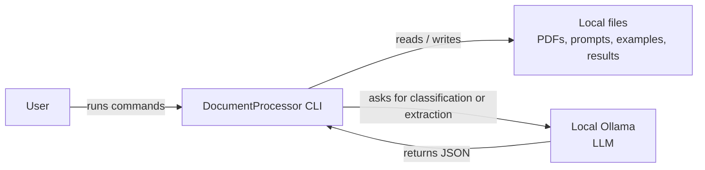
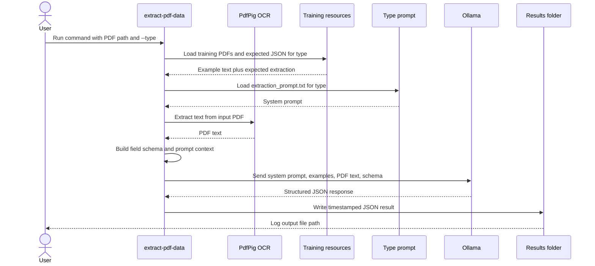

# DocumentProcessor

DocumentProcessor is a command line utility built with .NET for document processing.

## Table of Contents
- [System Context](#system-context)
- [Features](#features)
- [Prerequisites](#prerequisites)
  - [Ollama Setup](#ollama-setup)
  - [Alternative: Ollama Setup via Docker](#alternative-ollama-setup-via-docker)
- [Usage](#usage)
  - [Ollama Test](#ollama-test)
  - [PDF Classification](#pdf-classification)
  - [PDF Data Extraction](#pdf-data-extraction)
- [Extraction Flow](#extraction-flow)

## Features
- Analyze a pdf wether it is an invoice, correspondence or other document type.
- Extract document data as a JSON array of `FieldName`/`Text` pairs, matching the selected extraction type.

## System Context



## Prerequisites
- [Docker Desktop](https://www.docker.com/products/docker-desktop) up and running
- **Ollama** running locally with a compatible model (e.g., `qwen2.5:3b`, `qwen3:4b`, or `gemma4:31b`)

### Ollama Setup
```sh
# 1. Install Ollama via Homebrew or download from https://ollama.com/download
brew install ollama

# 2. Start Ollama service
ollama serve

# 3. Pull a model (in another terminal)
ollama pull gemma4:31b
```

### Alternative: Ollama Setup via Docker
```sh
cd ollama
docker-compose up -d
docker exec -it ollama ollama pull gemma4:31b
```

## Usage

From the repository root, with Ollama running and the selected model pulled.

### Ollama Test

Send a simple prompt to confirm the configured Ollama endpoint and model are reachable:

```sh
dotnet run --project src/DocumentProcessor -- test-ollama
```

Optionally override the prompt:

```sh
dotnet run --project src/DocumentProcessor -- test-ollama --prompt "Reply with READY."
```

### PDF Classification

Classify a PDF:

```sh
dotnet run --project src/DocumentProcessor -- classify-pdf files/classification/tests/invoice_3.pdf
```

By default, classification results are written to:

```text
files/classification/results/<document-type>/<pdf-filename>_<timestamp>.json
```

Classification results are written as a JSON object containing:

```json
{
  "Date": "2026-09-20T16:37:48.724+02:00",
  "Model": "qwen:4b",
  "ProcessingTimeMs": 1234,
  "Data": {
    "DocumentType": "INVOICE",
    "Confidence": 0.95,
    "Reasoning": "The document contains invoice number, line items and a total amount."
  },
  "RawOcr": "Raw text extracted from the PDF"
}
```

### PDF Data Extraction

Extract data from a PDF:

```sh
dotnet run --project src/DocumentProcessor -- extract-pdf-data \
	files/extraction/training/invoice/invoice_3.pdf \
	--type invoice
```

By default, extraction results are written to:

```text
files/extraction/results/<type>/<pdf-filename>_<timestamp>.json
```

## Extraction Flow



The current pipeline extracts text directly with PdfPig. OCR is not part of the extraction flow.

Extraction results are written as a JSON object containing:

```json
{
  "Date": "2026-09-20T16:36:46.546+02:00",
  "Model": "qwen:4b",
  "ProcessingTimeMs": 2345,
  "Data": [
    {
      "FieldName": "invoiceNumber",
      "Text": "2025-002"
    }
  ],
  "RawOcr": "Raw text extracted from the PDF"
}
```
